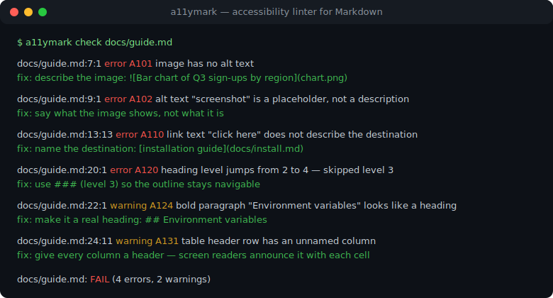
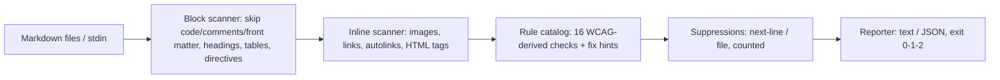

# a11ymark

[English](README.md) | [中文](README.zh.md) | [日本語](README.ja.md)

[](LICENSE)   [](CONTRIBUTING.md)

**オープンソース・依存ゼロの Markdown アクセシビリティ linter — 代替テキストの質、リンクテキスト、見出し構造、テーブルヘッダーを WCAG 由来のコンテンツルールで検査し、すべての指摘に具体的な修正ヒントを添える。**



```bash
# not yet on npm — install from a checkout of this repository
npm install && npm run build && npm pack
npm install -g ./a11ymark-0.1.0.tgz
```

## なぜ a11ymark？

アクセシビリティ規制はドキュメントにも及んでいる——2025 年に欧州アクセシビリティ法（EAA）の執行が始まって以来、製品に付属するドキュメントは製品の一部であり——そしてドキュメントの大半はプレーンな Markdown だ。ツールの空白は現実にある：markdownlint と remark-lint が見るのは*構文スタイル*（裸 URL の書式は指摘しても `[click here](…)` や `` は素通しする）で、pa11y や axe が監査するのは*レンダリング済み HTML ページ*であり、ビルド済みサイトとブラウザとクロール可能な URL を必要とする。a11ymark は `.md` ファイルの中身そのものを検査する：代替テキストは本物の説明かエディタが自動挿入したファイル名か、リンクテキストは行き先を名指ししているか、見出しアウトラインはレベルを飛ばしていないか、テーブルの各列にヘッダーはあるか。16 のルールはそれぞれ由来する WCAG 達成基準を明記し、すべての指摘に具体的な修正ヒントが付き、抑制された指摘はレポートに計上され握りつぶされない——出力はそのまま CI とコードレビューに投入できる。

| 観点 | a11ymark | markdownlint | remark-lint | pa11y / axe |
|---|---|---|---|---|
| 焦点 | アクセシビリティ内容ルール | Markdown スタイル/構文 | Markdown スタイル、プラグイン式 | レンダリング済みページ監査 |
| 代替テキストの*質*（プレースホルダー、ファイル名、接頭辞） | あり | 有無のみ（MD045） | プラグインで有無のみ | 有無のみ |
| 「click here」等の汎用リンクテキスト | あり（約 35 句のブロックリスト） | なし | なし | 一部（ルールセット次第） |
| 素の `.md` で動作、ビルドもブラウザも不要 | あり | あり | あり | なし——レンダリング済みページが必要 |
| すべての指摘に修正ヒント | あり | 一部 | なし | 一部 |
| ルールごとに WCAG 基準を明記 | あり | なし | なし | あり |
| 設定の要否 | 不要 | 設定ファイルが通例 | プラグイン選定が必要 | CI ハーネスが必要 |
| ランタイム依存 | 0 | 約 10 | 約 30（典型プリセット） | 50 超＋ブラウザ |

<sub>機能と依存数は各プロジェクトの公開ドキュメントと npm メタデータで確認、2026-07。</sub>

## 特徴

- **代替テキストは有無ではなく質を見る** — 空 alt、プレースホルダー語（"screenshot"、"logo"、"tbd"）、カメラ命名（`IMG_1234`）、ファイル名そのままの alt、冗長な "image of" 接頭辞、長さ超過をそれぞれ別個の指摘として区別し、修正方法も別々に示す；明示的な HTML `` は文書化された装飾宣言として通す。
- **スクリーンリーダーが辿れるリンクテキスト** — 厳選した汎用句ブロックリスト（"click here"、"read more" など）、裸 URL テキスト、空リンク、アクセシブルネームのない画像リンク、同一テキストが異なる行き先を指すケース；画像リンクの名前は支援技術と同じく alt テキストから算出する。
- **見出しアウトラインはナビゲーションそのもの** — レベル飛ばし、H1 の欠落/重複、空見出し、見出しに成りすます単独の太字段落（アウトラインナビゲーションから見えない）に、それぞれ専用ルールを用意。
- **CommonMark を理解する抽出器** — インライン/参照/省略形の画像とリンク、オートリンク、HTML ``/`<a>`/`<table>`、GFM パイプテーブル、setext 見出し、コードスパンのマスクとエスケープ；フェンス/インデントコード、コメント、front matter、参照定義は決して検査されないため、実在の README でもクリーンに走る。
- **CI のための設計** — 決定的な出力、`--format json`（安定したスキーマ）、`--strict`、`--disable`、stdin 対応、`node_modules` を飛ばす再帰的ディレクトリ走査、指摘（1）と使用法エラー（2）を区別する終了コード。
- **ランタイム依存ゼロ、完全オフライン** — 必要なのは Node.js だけ；パース、ルール、レポートはすべてリポジトリ内で実装され、ツールがソケットを開くことは決してない。

## クイックスタート

インストール：

```bash
# not yet on npm — install from a checkout of this repository
npm install && npm run build && npm pack
npm install -g ./a11ymark-0.1.0.tgz
```

同梱の問題例をチェックする——数か月レビューされずに編集され続けた運用ガイド：

```bash
a11ymark check examples/flawed.md
```

出力（実際の実行の抜粋、全体では 6 エラー・6 警告）：

```text
examples/flawed.md:7:1  error A101  image has no alt text
    fix: describe the image: 
examples/flawed.md:9:1  error A102  alt text "screenshot" is a placeholder, not a description
    fix: say what the image shows, not what it is: 
examples/flawed.md:13:13  error A110  link text "click here" does not describe the destination
    fix: name the destination: [installation guide](docs/install.md), not [click here](docs/install.md)
examples/flawed.md:16:1  error A104  link contains only an image with no alt text — the link has no accessible name
    fix: give the image alt text naming the destination: [](https://example.test)
examples/flawed.md:20:1  error A120  heading level jumps from 2 to 4 — skipped level 3
    fix: use ### (level 3) so the outline stays navigable
examples/flawed.md:22:1  warning A124  bold paragraph "Environment variables" looks like a heading but is invisible to the document outline
    fix: make it a real heading: ## Environment variables

examples/flawed.md: FAIL (6 errors, 6 warnings, 1 suppressed)
```

終了コードは 1——そのまま CI に組み込める。ディレクトリは再帰的に走査され、stdin は pre-commit フックに向く（実際の実行）：

```bash
git show :README.md | a11ymark check -
```

```text
(stdin): OK (0 errors, 0 warnings)
```

クリーンな双子 `examples/clean.md` は終了コード 0。さらなるシナリオは [examples/](examples/README.md) に。

## ルール

error はスクリーンリーダー利用者が壁として突き当たる指摘、warning は摩擦。ルールコードは安定 API であり、番号の振り直しは決してしない。各ルールの根拠・例・既知の限界は [docs/rules.md](docs/rules.md) に、`a11ymark rules` でツール自身からこの表を出力できる。

| ルール | 重大度 | WCAG | 検査内容 |
|---|---|---|---|
| A101 | error | 1.1.1 | 代替テキストのない画像（``、`alt` なしの ``） |
| A102 | error | 1.1.1 | プレースホルダー alt："screenshot"、`IMG_1234`、ファイル名そのまま |
| A103 | warning | 1.1.1 | 冗長な "image of / photo of" 接頭辞 |
| A104 | error | 2.4.4 | 画像のみでアクセシブルネームのないリンク |
| A105 | warning | 1.1.1 | 代替テキストの長さ超過（既定 125、`--max-alt-length`） |
| A110 | error | 2.4.4 | 汎用リンクテキスト（"click here"、"read more" など） |
| A111 | warning | 2.4.4 | 裸 URL のリンクテキスト（`mailto:` は免除） |
| A112 | error | 2.4.4 | 空のリンクテキスト |
| A113 | warning | 2.4.4 | 同一リンクテキスト → 異なる行き先 |
| A120 | error | 1.3.1 | 見出しレベルの飛ばし（## → ####） |
| A121 | warning | 1.3.1 | 最初の見出しがレベル 1 でない |
| A122 | warning | 1.3.1 | レベル 1 見出しが複数 |
| A123 | error | 2.4.6 | 空の見出し |
| A124 | warning | 1.3.1 | 見出しに成りすます太字段落 |
| A130 | error | 1.3.1 | ヘッダーセルのないテーブル（`role="presentation"` は免除） |
| A131 | warning | 1.3.1 | テーブルヘッダー行の無名の列 |

偽陽性には精密で*可視の*逃げ道を用意——抑制された指摘はサマリーに計上され、決して握りつぶされない：

```markdown
<!-- a11ymark-disable-next-line A103 -->

```

## CLI リファレンス

`a11ymark check <path…>` はファイル、ディレクトリ（再帰）、stdin（`-`）を検査する；パスを直接渡してもよい。`a11ymark rules` はルール目録を出力する。

| フラグ | 既定値 | 効果 |
|---|---|---|
| `--format text\|json` | `text` | レポート形式；JSON は CI 向けの安定スキーマ |
| `--strict` | off | 警告でも実行を失敗させる（終了コード 1） |
| `--disable CODES` | なし | 無効化するルールコードのカンマ区切り（繰り返し可） |
| `--max-alt-length N` | `125` | A105 の代替テキスト長の予算 |
| `-q, --quiet` | off | ファイルごとのサマリー行のみ |

終了コード：`0` クリーン、`1` 指摘あり（`--strict` 時は警告も）、`2` 使用法/IO エラー——スクリプトは「文書が不合格」と「コマンドの誤用」を区別できる。

## アーキテクチャ



## ロードマップ

- [x] WCAG 由来の 16 ルール目録、CommonMark を理解する抽出器、修正ヒント、抑制機構、JSON 出力、ディレクトリ/stdin CLI（v0.1.0）
- [ ] 複数行にまたがるインライン構造（行をまたぐリンクや `` タグ）
- [ ] 言語別のプレースホルダー/汎用句リスト（de、fr、ja）を `--lang` フラグで
- [ ] 機械的に直せるケースの `--fix`（冗長 alt 接頭辞の除去、重複 H1 の降格）
- [ ] プロジェクト既定値のための設定ファイル（`.a11ymarkrc`）

全リストは [open issues](https://github.com/JaydenCJ/a11ymark/issues) を参照。

## コントリビュート

コントリビューション歓迎。`npm install && npm run build` でビルドし、`npm test`（90 テスト）と `bash scripts/smoke.sh`（`SMOKE OK` が出力されること）を実行——このリポジトリは CI を同梱せず、上記の主張はすべてローカル実行で検証されている。[CONTRIBUTING.md](CONTRIBUTING.md) を読み、[good first issue](https://github.com/JaydenCJ/a11ymark/issues?q=is%3Aissue+is%3Aopen+label%3A%22good+first+issue%22) を拾うか、[discussion](https://github.com/JaydenCJ/a11ymark/discussions) を始めてほしい。

## ライセンス

[MIT](LICENSE)
