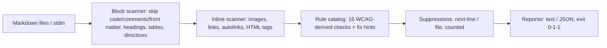

# a11ymark

[English](README.md) | [中文](README.zh.md) | [日本語](README.ja.md)

[](LICENSE)   [](CONTRIBUTING.md)

**An open-source, zero-dependency accessibility linter for Markdown — WCAG-derived content rules for alt-text quality, link text, heading structure and table headers, with a concrete fix hint on every finding.**


```bash
# not yet on npm — install from a checkout of this repository
npm install && npm run build && npm pack
npm install -g ./a11ymark-0.1.0.tgz
```

## Why a11ymark?

Accessibility regulation now reaches documentation — since the European Accessibility Act became enforceable in 2025, docs shipped with a product are part of the product — and most documentation is plain Markdown. The tooling gap is real: markdownlint and remark-lint check *syntax style* (they will flag a bare URL's formatting but happily pass `[click here](…)` and ``), while pa11y and axe audit *rendered HTML pages* and need a built site, a browser, and a URL to crawl. a11ymark lints the content itself, straight from the `.md` file: is the alt text a real description or an editor-autofilled filename, does the link text name its destination, does the heading outline skip levels, does every table column have a header. Each of its 16 rules cites the WCAG success criterion it derives from, every finding carries a concrete fix hint, and suppressions are counted in the report rather than swallowed — so the output drops into CI and into code review as-is.

| Capability | a11ymark | markdownlint | remark-lint | pa11y / axe |
|---|---|---|---|---|
| Focus | accessibility content rules | Markdown style/syntax | Markdown style, pluggable | rendered-page audits |
| Alt-text *quality* (placeholders, filenames, prefixes) | yes | presence only (MD045) | presence via plugin | presence only |
| "click here" / generic link text | yes (~35-phrase blocklist) | no | no | partial (some rulesets) |
| Works on plain `.md`, no build or browser | yes | yes | yes | no — needs a rendered page |
| Fix hint on every finding | yes | partial | no | partial |
| WCAG criterion cited per rule | yes | no | no | yes |
| Config required | none | config file typical | plugin selection | CI harness |
| Runtime dependencies | 0 | ~10 | ~30 (typical preset) | ~50+ and a browser |

<sub>Capability and dependency counts checked against each project's public docs and npm metadata, 2026-07.</sub>

## Features

- **Alt-text quality, not just presence** — empty alts, placeholder words ("screenshot", "logo", "tbd"), camera-roll names (`IMG_1234`), filename-as-alt, redundant "image of" prefixes and over-budget length are all distinct findings with distinct fixes; explicit HTML `` is honored as the documented decorative opt-out.
- **Link text a screen reader can navigate by** — a curated generic-phrase blocklist ("click here", "read more", …), raw-URL text, empty links, image links with no accessible name, and identical texts pointing at different destinations; image-link names are computed from alt text, the way assistive technology does it.
- **Heading outline = navigation** — skipped levels, missing/duplicate H1, empty headings, and standalone bold paragraphs posing as headings (invisible to outline navigation) each get their own rule.
- **CommonMark-aware extraction** — inline/reference/collapsed images and links, autolinks, HTML ``/`<a>`/`<table>`, GFM pipe tables, setext headings, code-span masking and escapes; fenced/indented code, comments, front matter and reference definitions are never linted, so it runs clean on real READMEs.
- **Built for CI** — deterministic output, `--format json` (stable shape), `--strict`, `--disable`, stdin support, directory walking with `node_modules` skipped, and exit codes that distinguish findings (1) from usage errors (2).
- **Zero runtime dependencies, fully offline** — Node.js is the only requirement; parsing, rules and reporting are all in-repo, and the tool never opens a socket.

## Quickstart

Install:

```bash
# not yet on npm — install from a checkout of this repository
npm install && npm run build && npm pack
npm install -g ./a11ymark-0.1.0.tgz
```

Check the bundled flawed example — an ops guide after months of unreviewed edits:

```bash
a11ymark check examples/flawed.md
```

Output (real captured run, abridged — 6 errors and 6 warnings in total):

```text
examples/flawed.md:7:1  error A101  image has no alt text
    fix: describe the image: 
examples/flawed.md:9:1  error A102  alt text "screenshot" is a placeholder, not a description
    fix: say what the image shows, not what it is: 
examples/flawed.md:13:13  error A110  link text "click here" does not describe the destination
    fix: name the destination: [installation guide](docs/install.md), not [click here](docs/install.md)
examples/flawed.md:16:1  error A104  link contains only an image with no alt text — the link has no accessible name
    fix: give the image alt text naming the destination: [](https://example.test)
examples/flawed.md:20:1  error A120  heading level jumps from 2 to 4 — skipped level 3
    fix: use ### (level 3) so the outline stays navigable
examples/flawed.md:22:1  warning A124  bold paragraph "Environment variables" looks like a heading but is invisible to the document outline
    fix: make it a real heading: ## Environment variables

examples/flawed.md: FAIL (6 errors, 6 warnings, 1 suppressed)
```

Exit code 1 — drop it into CI as-is. Directories are walked recursively, and stdin works for pre-commit hooks (real captured run):

```bash
git show :README.md | a11ymark check -
```

```text
(stdin): OK (0 errors, 0 warnings)
```

The clean twin `examples/clean.md` exits 0. More scenarios live in [examples/](examples/README.md).

## Rules

Errors are findings a screen-reader user hits as a wall; warnings are friction. Codes are stable API, never renumbered. Full rationale, examples and known limits per rule in [docs/rules.md](docs/rules.md); `a11ymark rules` prints this table from the tool itself.

| Rule | Severity | WCAG | Checks |
|---|---|---|---|
| A101 | error | 1.1.1 | image has no alt text (``, `` without `alt`) |
| A102 | error | 1.1.1 | placeholder alt: "screenshot", `IMG_1234`, filename-as-alt |
| A103 | warning | 1.1.1 | redundant "image of / photo of" prefix |
| A104 | error | 2.4.4 | image-only link with no accessible name |
| A105 | warning | 1.1.1 | alt text over budget (default 125, `--max-alt-length`) |
| A110 | error | 2.4.4 | generic link text ("click here", "read more", …) |
| A111 | warning | 2.4.4 | raw URL as link text (`mailto:` exempt) |
| A112 | error | 2.4.4 | empty link text |
| A113 | warning | 2.4.4 | same link text → different destinations |
| A120 | error | 1.3.1 | skipped heading level (## → ####) |
| A121 | warning | 1.3.1 | first heading is not level 1 |
| A122 | warning | 1.3.1 | more than one level-1 heading |
| A123 | error | 2.4.6 | empty heading |
| A124 | warning | 1.3.1 | bold paragraph posing as a heading |
| A130 | error | 1.3.1 | table without header cells (`role="presentation"` exempt) |
| A131 | warning | 1.3.1 | unnamed column in a table header row |

False positives get precise, *visible* escape hatches — suppressed findings are counted in the summary, never swallowed:

```markdown
<!-- a11ymark-disable-next-line A103 -->

```

## CLI reference

`a11ymark check <path…>` lints files, directories (recursive) and stdin (`-`); a bare path also works. `a11ymark rules` prints the catalog.

| Flag | Default | Effect |
|---|---|---|
| `--format text\|json` | `text` | report format; JSON is a stable shape for CI |
| `--strict` | off | warnings also fail the run (exit 1) |
| `--disable CODES` | none | comma-separated rule codes to switch off (repeatable) |
| `--max-alt-length N` | `125` | alt-text length budget for A105 |
| `-q, --quiet` | off | per-file summary lines only |

Exit codes: `0` clean, `1` findings (or warnings under `--strict`), `2` usage/IO error — so scripts can tell an inaccessible document from a broken invocation.

## Architecture



## Roadmap

- [x] 16-rule WCAG-derived catalog, CommonMark-aware extraction, fix hints, suppressions, JSON output, directory/stdin CLI (v0.1.0)
- [ ] Multi-line inline constructs (links and `` tags wrapped across lines)
- [ ] Language-aware placeholder/generic-phrase lists (de, fr, ja) behind a `--lang` flag
- [ ] `--fix` for the mechanical cases (drop redundant alt prefixes, demote duplicate H1s)
- [ ] Config file (`.a11ymarkrc`) for per-project defaults

See the [open issues](https://github.com/JaydenCJ/a11ymark/issues) for the full list.

## Contributing

Contributions are welcome. Build with `npm install && npm run build`, then run `npm test` (90 tests) and `bash scripts/smoke.sh` (must print `SMOKE OK`) — this repository ships no CI, every claim above is verified by local runs. See [CONTRIBUTING.md](CONTRIBUTING.md), grab a [good first issue](https://github.com/JaydenCJ/a11ymark/issues?q=is%3Aissue+is%3Aopen+label%3A%22good+first+issue%22), or start a [discussion](https://github.com/JaydenCJ/a11ymark/discussions).

## License

[MIT](LICENSE)
