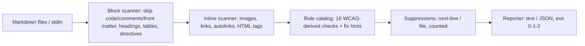

# a11ymark

[English](README.md) | [中文](README.zh.md) | [日本語](README.ja.md)

[](LICENSE)   [](CONTRIBUTING.md)

**开源、零依赖的 Markdown 无障碍 linter —— 源自 WCAG 的内容规则，覆盖替代文本质量、链接文字、标题结构与表格表头，每条发现都附带具体的修复提示。**


```bash
# not yet on npm — install from a checkout of this repository
npm install && npm run build && npm pack
npm install -g ./a11ymark-0.1.0.tgz
```

## 为什么选 a11ymark？

无障碍法规已经延伸到了文档——自 2025 年欧洲无障碍法案（EAA）开始执法，随产品交付的文档就是产品的一部分——而绝大多数文档都是纯 Markdown。工具链的空缺是真实存在的：markdownlint 和 remark-lint 检查的是*语法风格*（它们会挑剔裸 URL 的排版，却对 `[click here](…)` 和 `` 视而不见），而 pa11y 和 axe 审计的是*渲染后的 HTML 页面*，需要构建好的站点、浏览器和可爬取的 URL。a11ymark 直接对 `.md` 文件的内容本身做检查：替代文本是真实的描述还是编辑器自动填入的文件名，链接文字是否说清了目的地，标题大纲有没有跳级，每个表格列是否都有表头。16 条规则每条都注明其源自的 WCAG 成功标准，每条发现都附带具体的修复提示，抑制的发现会计入报告而不是被吞掉——输出可以原样接入 CI 和代码评审。

| 能力 | a11ymark | markdownlint | remark-lint | pa11y / axe |
|---|---|---|---|---|
| 关注点 | 无障碍内容规则 | Markdown 风格/语法 | Markdown 风格，插件化 | 渲染页面审计 |
| 替代文本*质量*（占位词、文件名、前缀） | 是 | 仅检查有无（MD045） | 插件检查有无 | 仅检查有无 |
| "click here" / 泛化链接文字 | 是（约 35 条短语黑名单） | 否 | 否 | 部分（个别规则集） |
| 直接检查 `.md`，无需构建或浏览器 | 是 | 是 | 是 | 否——需要渲染后的页面 |
| 每条发现都附修复提示 | 是 | 部分 | 否 | 部分 |
| 每条规则注明 WCAG 标准 | 是 | 否 | 否 | 是 |
| 是否需要配置 | 不需要 | 通常需要配置文件 | 需要挑选插件 | 需要 CI 挂载 |
| 运行时依赖 | 0 | 约 10 | 约 30（典型预设） | 50+ 且需要浏览器 |

<sub>能力与依赖数量核对自各项目的公开文档与 npm 元数据，2026-07。</sub>

## 功能

- **替代文本查质量，而不只是查有无** —— 空 alt、占位词（"screenshot"、"logo"、"tbd"）、相机命名（`IMG_1234`）、文件名充当 alt、冗余的 "image of" 前缀、超出长度预算，都是各自独立的发现、各有各的修复方式；显式的 HTML `` 会被视为文档化的装饰性声明予以放行。
- **让屏幕阅读器能据以导航的链接文字** —— 精选的泛化短语黑名单（"click here"、"read more" 等）、裸 URL 文字、空链接、没有可访问名称的图片链接、相同文字指向不同目的地；图片链接的名称按辅助技术的方式由 alt 文本计算得出。
- **标题大纲就是导航** —— 跳级、缺失/重复的 H1、空标题、以及冒充标题的独立粗体段落（对大纲导航完全不可见），各有专属规则。
- **理解 CommonMark 的提取器** —— 行内/引用式/折叠式图片和链接、自动链接、HTML ``/`<a>`/`<table>`、GFM 管道表格、setext 标题、代码段屏蔽与转义；围栏/缩进代码、注释、front matter 和引用定义永远不会被检查，因此在真实 README 上跑得干干净净。
- **为 CI 而生** —— 确定性输出、`--format json`（稳定结构）、`--strict`、`--disable`、支持 stdin、递归遍历目录并跳过 `node_modules`，退出码区分发现（1）与用法错误（2）。
- **零运行时依赖，完全离线** —— 唯一要求是 Node.js；解析、规则和报告全部在仓库内实现，工具永远不会打开网络连接。

## 快速上手

安装：

```bash
# not yet on npm — install from a checkout of this repository
npm install && npm run build && npm pack
npm install -g ./a11ymark-0.1.0.tgz
```

检查内置的问题示例——一份经历了数月无人评审修改的运维指南：

```bash
a11ymark check examples/flawed.md
```

输出（真实运行截取，共 6 个错误、6 个警告）：

```text
examples/flawed.md:7:1  error A101  image has no alt text
    fix: describe the image: 
examples/flawed.md:9:1  error A102  alt text "screenshot" is a placeholder, not a description
    fix: say what the image shows, not what it is: 
examples/flawed.md:13:13  error A110  link text "click here" does not describe the destination
    fix: name the destination: [installation guide](docs/install.md), not [click here](docs/install.md)
examples/flawed.md:16:1  error A104  link contains only an image with no alt text — the link has no accessible name
    fix: give the image alt text naming the destination: [](https://example.test)
examples/flawed.md:20:1  error A120  heading level jumps from 2 to 4 — skipped level 3
    fix: use ### (level 3) so the outline stays navigable
examples/flawed.md:22:1  warning A124  bold paragraph "Environment variables" looks like a heading but is invisible to the document outline
    fix: make it a real heading: ## Environment variables

examples/flawed.md: FAIL (6 errors, 6 warnings, 1 suppressed)
```

退出码为 1——可以原样放进 CI。目录会被递归遍历，stdin 适合 pre-commit 钩子（真实运行）：

```bash
git show :README.md | a11ymark check -
```

```text
(stdin): OK (0 errors, 0 warnings)
```

干净的孪生示例 `examples/clean.md` 退出码为 0。更多场景见 [examples/](examples/README.md)。

## 规则

错误（error）是屏幕阅读器用户会撞上的墙；警告（warning）是摩擦。规则代码是稳定 API，永不重新编号。每条规则的完整依据、示例与已知边界见 [docs/rules.md](docs/rules.md)；`a11ymark rules` 可以从工具本身打印这张表。

| 规则 | 严重级 | WCAG | 检查内容 |
|---|---|---|---|
| A101 | error | 1.1.1 | 图片没有替代文本（``、无 `alt` 的 ``） |
| A102 | error | 1.1.1 | 占位 alt："screenshot"、`IMG_1234`、文件名充当 alt |
| A103 | warning | 1.1.1 | 冗余的 "image of / photo of" 前缀 |
| A104 | error | 2.4.4 | 只含图片且没有可访问名称的链接 |
| A105 | warning | 1.1.1 | 替代文本超出预算（默认 125，`--max-alt-length`） |
| A110 | error | 2.4.4 | 泛化链接文字（"click here"、"read more" 等） |
| A111 | warning | 2.4.4 | 裸 URL 充当链接文字（`mailto:` 豁免） |
| A112 | error | 2.4.4 | 链接文字为空 |
| A113 | warning | 2.4.4 | 相同链接文字 → 不同目的地 |
| A120 | error | 1.3.1 | 标题跳级（## → ####） |
| A121 | warning | 1.3.1 | 首个标题不是一级标题 |
| A122 | warning | 1.3.1 | 一级标题多于一个 |
| A123 | error | 2.4.6 | 空标题 |
| A124 | warning | 1.3.1 | 冒充标题的粗体段落 |
| A130 | error | 1.3.1 | 表格没有表头单元格（`role="presentation"` 豁免） |
| A131 | warning | 1.3.1 | 表头行中存在未命名的列 |

误报有精确且*可见*的逃生通道——被抑制的发现会计入摘要，绝不会被吞掉：

```markdown
<!-- a11ymark-disable-next-line A103 -->

```

## CLI 参考

`a11ymark check <path…>` 检查文件、目录（递归）和 stdin（`-`）；直接给路径也可以。`a11ymark rules` 打印规则目录。

| 选项 | 默认值 | 效果 |
|---|---|---|
| `--format text\|json` | `text` | 报告格式；JSON 为面向 CI 的稳定结构 |
| `--strict` | 关 | 有警告也让运行失败（退出码 1） |
| `--disable CODES` | 无 | 逗号分隔的要关闭的规则代码（可重复） |
| `--max-alt-length N` | `125` | A105 的替代文本长度预算 |
| `-q, --quiet` | 关 | 只输出每个文件的摘要行 |

退出码：`0` 干净，`1` 有发现（或 `--strict` 下有警告），`2` 用法/IO 错误——脚本可以区分"文档不达标"和"命令用错了"。

## 架构



## 路线图

- [x] 16 条源自 WCAG 的规则目录、理解 CommonMark 的提取器、修复提示、抑制机制、JSON 输出、目录/stdin CLI（v0.1.0）
- [ ] 跨行的行内结构（跨行书写的链接与 `` 标签）
- [ ] 按语言的占位词/泛化短语列表（de、fr、ja），通过 `--lang` 开启
- [ ] 针对机械可修场景的 `--fix`（去掉冗余 alt 前缀、降级重复 H1）
- [ ] 配置文件（`.a11ymarkrc`）承载项目级默认值

完整列表见 [open issues](https://github.com/JaydenCJ/a11ymark/issues)。

## 参与贡献

欢迎贡献。先 `npm install && npm run build` 构建，然后运行 `npm test`（90 个测试）和 `bash scripts/smoke.sh`（必须打印 `SMOKE OK`）——本仓库不附带 CI，上述所有断言都由本地运行验证。参见 [CONTRIBUTING.md](CONTRIBUTING.md)，认领一个 [good first issue](https://github.com/JaydenCJ/a11ymark/issues?q=is%3Aissue+is%3Aopen+label%3A%22good+first+issue%22)，或发起一个 [discussion](https://github.com/JaydenCJ/a11ymark/discussions)。

## 许可证

[MIT](LICENSE)
